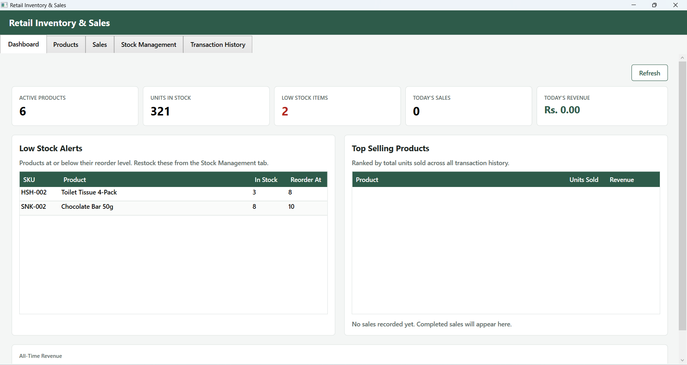

# Retail Inventory & Sales

A desktop application for managing a small retail store — products, sales, stock, and transaction history — built with .NET 8 and WPF.



## Features

- **Product Management** — add, edit, search, and deactivate products, with SKU, pricing, and reorder levels.
- **Sales** — cart-based checkout with live stock validation, discount %, tax %, payment method, and auto-generated invoice numbers.
- **Stock Management** — manual stock adjustments (restock / correction / return) backed by a full movement audit trail, so every change is traceable.
- **Transaction History** — browse past sales with a master/detail view of every line item.
- **Dashboard** — a live summary of the business: active products, units in stock, low-stock alerts, today's sales/revenue, and a top-selling-products ranking.

## Tech Stack

| Layer | Choice |
|---|---|
| Platform | .NET 8 (`net8.0-windows`) |
| UI | WPF |
| Data storage | Local JSON files (`System.Text.Json`) |
| Architecture | Layered: Models / Data (`DataService`) / Views |

JSON-file storage was chosen over a database engine to keep the project runnable on any Windows machine with just the .NET SDK — no database server, connection string, or extra driver to install. Business rules (validation, stock math, ID generation) live in a single `DataService` class rather than scattered across the UI, so the storage layer could be swapped for SQLite or SQL Server later with minimal changes elsewhere.

## Getting Started

### Prerequisites

- [.NET 8 SDK](https://dotnet.microsoft.com/download) or later
- Windows 10/11 (WPF is Windows-only)
- Visual Studio 2022 with the ".NET desktop development" workload (optional — the app also runs from the CLI)

### Run it

```bash
git clone https://github.com/Dinith2024/Retail-Inventory-Sales.git
cd Retail-Inventory-Sales
dotnet run --project RetailInventorySales/RetailInventorySales.csproj
```

Or open `RetailInventorySales.sln` in Visual Studio and press **F5**.

On first launch, the app seeds a handful of demo products automatically, so every screen has data to explore right away. From then on, everything you enter is saved locally and reloaded on the next run.

## Project Structure

```
RetailInventorySales/
├── Models/          Product, SaleTransaction, SaleLineItem, StockMovement
├── Data/            DataService (business rules) + JsonFileStore (persistence)
│   └── Store/       products.json / stock_movements.json / sales.json
│                    (created automatically on first run)
├── Views/           One UserControl per screen (Dashboard, Products, Sales,
│                    Stock, History)
├── App.xaml(.cs)    Application-wide styling and startup
└── MainWindow.xaml  Tab shell hosting the views
```

## Data Model

| File | Model | Key fields |
|---|---|---|
| `products.json` | `Product` | Id, SKU, Name, Category, Price, CostPrice, QuantityInStock, ReorderLevel, IsActive |
| `stock_movements.json` | `StockMovement` | Id, ProductId, MovementType, QuantityChange, ResultingStock, Notes, Timestamp |
| `sales.json` | `SaleTransaction` | Id, TransactionNumber, Timestamp, Items[], DiscountPercent, TaxPercent, PaymentMethod |

Sale line items and stock movements snapshot the product's SKU/name/price at the time of the transaction, so editing or deactivating a product later never changes what a historical record shows.

## Roadmap

- [ ] Move storage to SQLite / EF Core for better concurrency at scale
- [ ] Barcode scanner support on the Sales screen
- [ ] Receipt/invoice PDF export
- [ ] Role-based login (cashier vs. manager)
- [ ] Revenue trend charts on the Dashboard
- [ ] Unit tests around `DataService` validation and stock logic

## License

MIT